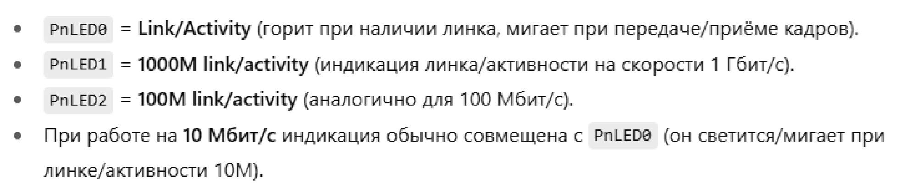

# Eth_switch_1gbit
на что смотрел: 
https://en.eeworld.com.cn/Reference_Designs/detail/76488 
https://lceda.cn/editor#id=103e28de87c54869b766a7df2fd9f07f 
https://github.com/Starrynightzyq/GE-Switch 
https://static.chipdip.ru/lib/518/DOC041518607.pdf 
https://oshwlab.com/hawaii0707/rtl8367rb-vb-cg 

инфа про светодиоды 
 
[коммит с релизной докой](https://github.com/cavesLezet/Eth_switch_1gbit/commit/48998cd221b385a8897a50ce54fa7af490ef88a7)